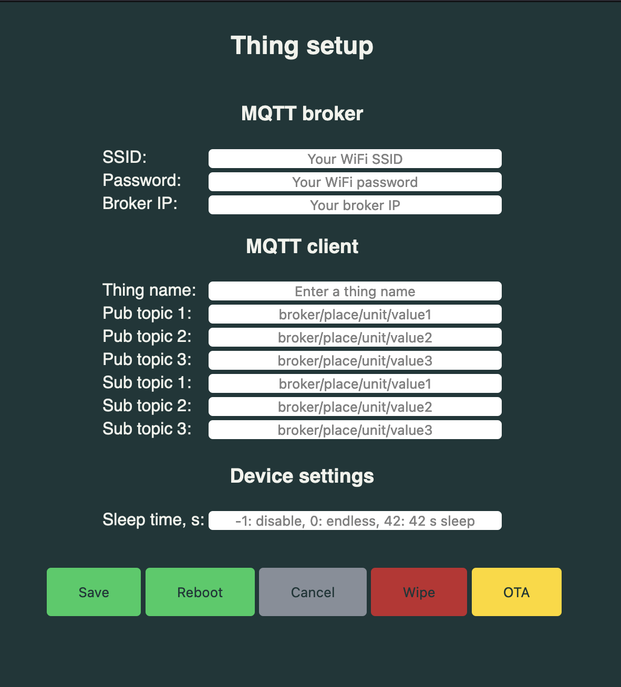

# Thing Manager
### ThingManager

Configure ESP WiFi credentials and other default values for a RTK rover. 
Start access point ("thing" + CHIP_ID + ".local"), go to 192.168.4.1, fill the web form, save and reboot. 
Use the saved data in your application.
